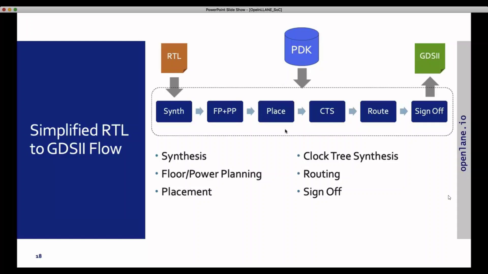
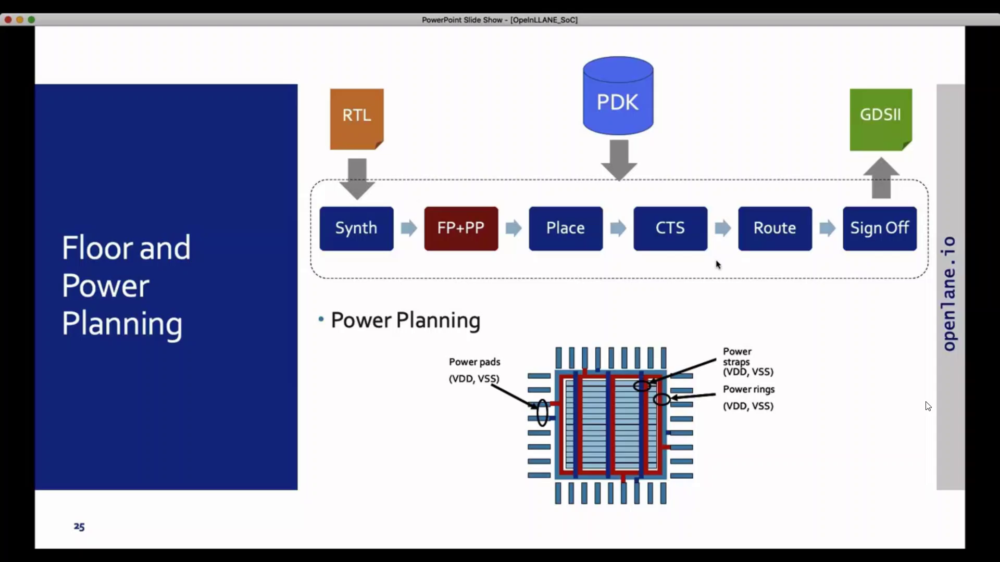

# Advanced Physical Design using Openlane Sky130

### ABOUT THE WORKSHOP
The Workshop is a 5-day basic to advance program that is design for fresher who wants to build a career in VLSI industry. It is a cloud based workshop that comprises of training courses that covers RTL to GDS topics, labs, intelligent assessment program, and documentation to be presented in github which may serve as a resume.
### AUTHOR OF THE WORKSHOP
#### Mr. Kunal Ghosh
Co-founder of VLSI System Design (VSD) Corporation Private Limited
### AGENDA
  - ##### Sky130 Day 1 - Inception of open-source EDA, OpenLANE and Sky130 PDK
    - SKY130_D1_SK1 - How to talk to computers
      - SKY_L1 - Introduction to QFN-48 Package, chip, pads, core, die and IPs
      - SKY_L2 - Introduction to RISC-V
      - SKY_L3 - From Software Applications to Hardware
    - SKY130_D1_SK2 - SoC design and OpenLANE
      - SKY_L1 - Introduction to all components of open-source digital asic design
      - SKY_L2 - Simplified RTL2GDS flow
      - SKY_L3 - Introduction to OpenLANE and Strive chipsets
      - SKY_L4 - Introduction to OpenLANE detailed ASIC design flow
    - SKY130_D1_SK3 - Get familiar to open-source EDA tools
      - SKY_L1 - OpenLANE Directory structure in detail
      - SKY_L2 - Design Preparation Step
      - SKY_L3 - Review files after design prep and run synthesis
      - SKY_L4 - OpenLANE Project Git Link Description
      - SKY_L5 - Steps to characterize synthesis results
 - ##### Sky130 Day 2 - Good floorplan vs bad floorplan and introduction to library cells
    - SKY130_D2_SK1 - Chip Floor planning considerations
      - SKY_L1 - Utilization factor and aspect ratio
      - SKY_L2 - Concept of pre-placed cells
      - SKY_L3 - De-coupling capacitors
      - SKY_L4 - Power planning
      - SKY_L5 - Pin placement and logical cell placement blockage
      - SKY_L6 - Steps to run floorplan using OpenLANE
      - SKY_L7 - Review floorplan files and steps to view floorplan
      - SKY_L8 - Review floorplan layout in Magic
    - SKY130_D2_SK2 - Library Binding and Placement
      - SKY_L1 - Netlist binding and initial place design
      - SKY_L2 - Optimize placement using estimated wire-length and capacitance
      - SKY_L3 - Final placement optimization
      - SKY_L4 - Need for libraries and characterization
      - SKY_L5 - Congestion aware placement using RePlAce
    - SKY130_D2_SK3 - Cell design and characterization flows
      - SKY_L1 - Inputs for cell design flow
      - SKY_L2 - Circuit design step
      - SKY_L3 - Layout design step
      - SKY_L4 - Typical characterization flow
    - SKY130_D2_SK4 - General timing characterization parameters
      - SKY_L1 - Timing threshold definitions
      - SKY_L2 - Propagation delay and transition time
 - ##### Sky130 Day 3 - Design library cell using Magic Layout and ngspice characterization
    - SKY130_D3_SK1 - Labs for CMOS inverter ngspice simulations
      - SKY_L0 - IO placer revision
      - SKY_L1 - SPICE deck creation for CMOS inverter
      - SKY_L2 - SPICE simulation lab for CMOS inverter
      - SKY_L3 - Switching Threshold Vm
      - SKY_L4 - Static and dynamic simulation of CMOS inverter
      - SKY_L5 - Lab steps to git clone vsdstdcelldesign
    - SKY130_D3_SK2 - Inception of Layout – CMOS fabrication process
      - SKY_L1 - Create Active regions
      - SKY_L2 - Formation of N-well and P-well
      - SKY_L3 - Formation of gate terminal
      - SKY_L4 - Lightly doped drain (LDD) formation
      - SKY_L5 - Source – drain formation
      - SKY_L6 - Local interconnect formation
      - SKY_L7 - Higher level metal formation
      - SKY_L8 - Lab introduction to Sky130 basic layers layout and LEF using inverter
      - SKY_L9 - Lab steps to create std cell layout and extract spice netlist
    - SKY130_D3_SK3 - Sky130 Tech File Labs
      - SKY_L1 - Lab steps to create final SPICE deck using Sky130 tech
      - SKY_L2 - Lab steps to characterize inverter using sky130 model files
      - SKY_L3 - Lab introduction to Magic tool options and DRC rules
      - SKY_L4 - Lab introduction to Sky130 pdk's and steps to download labs
      - SKY_L5 - Lab introduction to Magic and steps to load Sky130 tech-rules
      - SKY_L6 - Lab exercise to fix poly.9 error in Sky130 tech-file
      - SKY_L7 - Lab exercise to implement poly resistor spacing to diff and tap
      - SKY_L8 - Lab challenge exercise to describe DRC error as geometrical construct
      - SKY_L9 - Lab challenge to find missing or incorrect rules and fix them
## Sky130 Day 1 - Inception of open-source EDA, OpenLANE and Sky130 PDK
### SKY130_D1_SK1 - How to talk to computers
##### SKY_L1 - Introduction to QFN-48 Package, chip, pads, core, die and IPs

##### SKY_L2 - Introduction to RISC-V

##### SKY_L3 - From Software Applications to Hardware

### SKY130_D1_SK2 - SoC design and OpenLANE
##### SKY_L1 - Introduction to all components of open-source digital asic design

##### SKY_L2 - Simplified RTL2GDS flow

##### SKY_L3 - Introduction to OpenLANE and Strive chipsets

##### SKY_L4 - Introduction to OpenLANE detailed ASIC design flow

### SKY130_D1_SK3 - Get familiar to open-source EDA tools
##### SKY_L1 - OpenLANE Directory structure in detail

##### SKY_L2 - Design Preparation Step

##### SKY_L3 - Review files after design prep and run synthesis

##### SKY_L4 - OpenLANE Project Git Link Description
##### SKY_L5 - Steps to characterize synthesis results

## Sky130 Day 2 - Good floorplan vs bad floorplan and introduction to library cells
### SKY130_D2_SK1 - Chip Floor planning considerations
##### SKY_L1 - Utilization factor and aspect ratio

##### SKY_L2 - Concept of pre-placed cells

##### SKY_L3 - De-coupling capacitors

##### SKY_L4 - Power planning

##### SKY_L5 - Pin placement and logical cell placement blockage

##### SKY_L6 - Steps to run floorplan using OpenLANE

##### SKY_L7 - Review floorplan files and steps to view floorplan

##### SKY_L8 - Review floorplan layout in Magic

### SKY130_D2_SK2 - Library Binding and Placement
##### SKY_L1 - Netlist binding and initial place design

##### SKY_L2 - Optimize placement using estimated wire-length and capacitance

##### SKY_L3 - Final placement optimization

##### SKY_L4 - Need for libraries and characterization

##### SKY_L5 - Congestion aware placement using RePlAce

### SKY130_D2_SK3 - Cell design and characterization flows
##### SKY_L1 - Inputs for cell design flow

##### SKY_L2 - Circuit design step

##### SKY_L3 - Layout design step

##### SKY_L4 - Typical characterization flow

### SKY130_D2_SK4 - General timing characterization parameters
##### SKY_L1 - Timing threshold definitions

##### SKY_L2 - Propagation delay and transition time

##### Day 4

- label the port with associated pin number.

- assign each port as input or output port as in vtcon window.
- 

- generate a mag file for the inverter using the vtcon window as shown
- 

-generate a lef file from the mag file in the vtcon window with the command shown.

-inside the lef file is the pin sequence you assign using magic.

-copy the lef file and inv standard lib fle as highlighted into the picorv32/src folder.

-add the modify the config.tcl file as shown.

-

