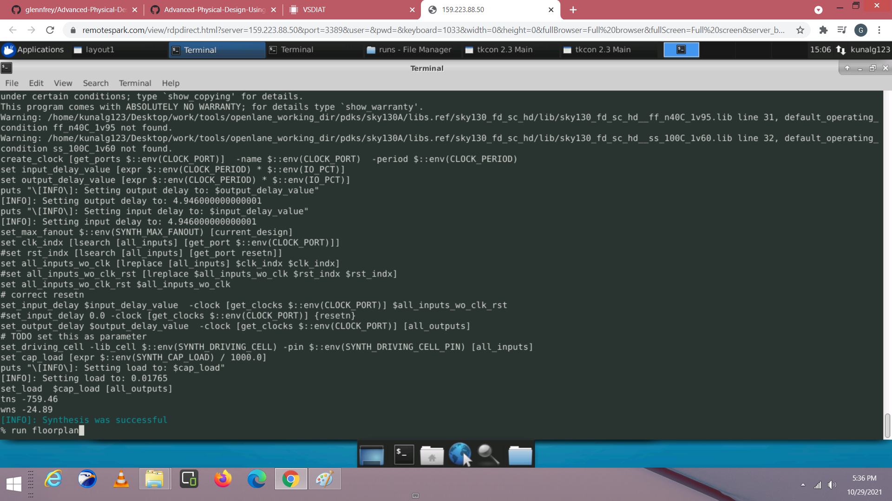
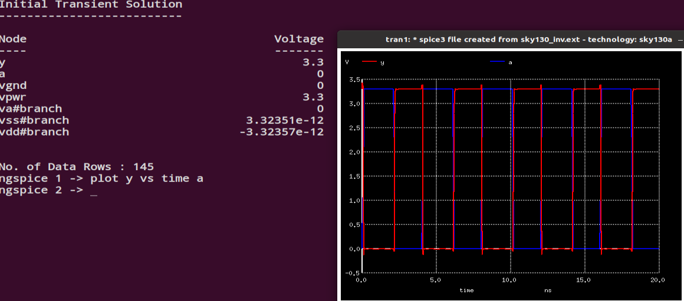

# Advanced Physical Design using Openlane Sky130

### ABOUT THE WORKSHOP
The Workshop is a 5-day basic to advance program that is design for fresher who wants to build a career in VLSI industry. It is a cloud based workshop that comprises of training courses that covers RTL to GDS topics, labs, intelligent assessment program, and documentation to be presented in github which may serve as a resume.
### AUTHOR OF THE WORKSHOP
#### Mr. Kunal Ghosh
Co-founder of VLSI System Design (VSD) Corporation Private Limited
### AGENDA
  - ##### Sky130 Day 1 - Inception of open-source EDA, OpenLANE and Sky130 PDK
    - SKY130_D1_SK1 - How to talk to computers
      - SKY_L1 - Introduction to QFN-48 Package, chip, pads, core, die and IPs
      - SKY_L2 - Introduction to RISC-V
      - SKY_L3 - From Software Applications to Hardware
    - SKY130_D1_SK2 - SoC design and OpenLANE
      - SKY_L1 - Introduction to all components of open-source digital asic design
      - SKY_L2 - Simplified RTL2GDS flow
      - SKY_L3 - Introduction to OpenLANE and Strive chipsets
      - SKY_L4 - Introduction to OpenLANE detailed ASIC design flow
    - SKY130_D1_SK3 - Get familiar to open-source EDA tools
      - SKY_L1 - OpenLANE Directory structure in detail
      - SKY_L2 - Design Preparation Step
      - SKY_L3 - Review files after design prep and run synthesis
      - SKY_L4 - OpenLANE Project Git Link Description
      - SKY_L5 - Steps to characterize synthesis results
 - ##### Sky130 Day 2 - Good floorplan vs bad floorplan and introduction to library cells
    - SKY130_D2_SK1 - Chip Floor planning considerations
      - SKY_L1 - Utilization factor and aspect ratio
      - SKY_L2 - Concept of pre-placed cells
      - SKY_L3 - De-coupling capacitors
      - SKY_L4 - Power planning
      - SKY_L5 - Pin placement and logical cell placement blockage
      - SKY_L6 - Steps to run floorplan using OpenLANE
      - SKY_L7 - Review floorplan files and steps to view floorplan
      - SKY_L8 - Review floorplan layout in Magic
    - SKY130_D2_SK2 - Library Binding and Placement
      - SKY_L1 - Netlist binding and initial place design
      - SKY_L2 - Optimize placement using estimated wire-length and capacitance
      - SKY_L3 - Final placement optimization
      - SKY_L4 - Need for libraries and characterization
      - SKY_L5 - Congestion aware placement using RePlAce
    - SKY130_D2_SK3 - Cell design and characterization flows
      - SKY_L1 - Inputs for cell design flow
      - SKY_L2 - Circuit design step
      - SKY_L3 - Layout design step
      - SKY_L4 - Typical characterization flow
    - SKY130_D2_SK4 - General timing characterization parameters
      - SKY_L1 - Timing threshold definitions
      - SKY_L2 - Propagation delay and transition time
 - ##### Sky130 Day 3 - Design library cell using Magic Layout and ngspice characterization
    - SKY130_D3_SK1 - Labs for CMOS inverter ngspice simulations
      - SKY_L0 - IO placer revision
      - SKY_L1 - SPICE deck creation for CMOS inverter
      - SKY_L2 - SPICE simulation lab for CMOS inverter
      - SKY_L3 - Switching Threshold Vm
      - SKY_L4 - Static and dynamic simulation of CMOS inverter
      - SKY_L5 - Lab steps to git clone vsdstdcelldesign
    - SKY130_D3_SK2 - Inception of Layout – CMOS fabrication process
      - SKY_L1 - Create Active regions
      - SKY_L2 - Formation of N-well and P-well
      - SKY_L3 - Formation of gate terminal
      - SKY_L4 - Lightly doped drain (LDD) formation
      - SKY_L5 - Source – drain formation
      - SKY_L6 - Local interconnect formation
      - SKY_L7 - Higher level metal formation
      - SKY_L8 - Lab introduction to Sky130 basic layers layout and LEF using inverter
      - SKY_L9 - Lab steps to create std cell layout and extract spice netlist
    - SKY130_D3_SK3 - Sky130 Tech File Labs
      - SKY_L1 - Lab steps to create final SPICE deck using Sky130 tech
      - SKY_L2 - Lab steps to characterize inverter using sky130 model files
      - SKY_L3 - Lab introduction to Magic tool options and DRC rules
      - SKY_L4 - Lab introduction to Sky130 pdk's and steps to download labs
      - SKY_L5 - Lab introduction to Magic and steps to load Sky130 tech-rules
      - SKY_L6 - Lab exercise to fix poly.9 error in Sky130 tech-file
      - SKY_L7 - Lab exercise to implement poly resistor spacing to diff and tap
      - SKY_L8 - Lab challenge exercise to describe DRC error as geometrical construct
      - SKY_L9 - Lab challenge to find missing or incorrect rules and fix them

### Introduction

- We started by how the application runs. Then go deep into the chip level and how VLSI came into the picture.

### RTL2GDS flow

- OpenLane flow is an RTL2GDS tool that uses several tool from synthesis, floorplan, placement, clock tree synthesis, routing, GDS generation to checkng. Below are the process flow and corresponding tools.

##### Synthesis
- yosys - Performs RTL synthesis
- abc - Performs technology mapping
- OpenSTA - Performs static timing analysis on the resulting netlist to generate timing reports
##### Floorplan and PDN
- init_fp - Defines the core area for the macro as well as the rows (used for placement) and the tracks (used for routing)
- ioplacer - Places the macro input and output ports
- pdn - Generates the power distribution network
- tapcell - Inserts welltap and decap cells in the floorplan
##### Placement
- RePLace - Performs global placement
- Resizer - Performs optional optimizations on the design
- OpenDP - Perfroms detailed placement to legalize the globally placed components
##### CTS
- TritonCTS - Synthesizes the clock distribution network (the clock tree)
##### Routing
- FastRoute - Performs global routing to generate a guide file for the detailed router
- CU-GR - Another option for performing global routing.
- TritonRoute - Performs detailed routing
- SPEF-Extractor - Performs SPEF extraction
##### GDSII Generation
- Magic - Streams out the final GDSII layout file from the routed def
- Klayout - Streams out the final GDSII layout file from the routed def as a back-up
- Checks
- Magic - Performs DRC Checks & Antenna Checks
- Klayout - Performs DRC Checks
- Netgen - Performs LVS Checks
- CVC - Performs Circuit Validity Checks

### - COMMAND FLOW

  - prep design
  - run_synthesis
  - run_floorplan
  - run_placement
  - run_cts
  - gen_pdn
  - run_routing
  - run_magic
  - run_magic_spice_export
  - run_magic_drc
  - run_lvs
  - run_magic_antenna_check

### Day 1

- In day 1 we explore how OpenLane works with Sky130 PDK, its working directory, its initial configurations, how to invoke commands and where to find the generated results.

- as shown sky130a.tech is the Skywater PDK we are using. It composes of libs.tech and libs.ref. These file is dependent on the process technology we are using. In this case, the parameters, tools and technology use in skywater foundry.

- the files inside 

- this files inside sky130_fd_sc_hd are use by the EDA tools in the design process.

- inside openlane/designs are the open RTL designs ready for use. In this lab we are using RISC-V picorv32.v and INVERTER inv.v

##### Design Preparation Step

- To start openlane we invoke the following commands:

* docker - to open openlane
* ./flow.tcl -interactive
* prep design - to prepare necessary files in the project you are working
* package require openlane 0.9 - to get the latest version

##### Review files after design prep and run synthesis

- after invoking run_synthesis command in openlane. a run folder is generated which comprises of results, reports, temportary files and configurations.

- directory tree generated inside runs folder

-  ├── runs
-  │   ├── <tag>
-  │   │   ├── config.tcl
-  │   │   ├── logs
-  │   │   │   ├── cts
-  │   │   │   ├── cvc
-  │   │   │   ├── floorplan
-  │   │   │   ├── klayout
-  │   │   │   ├── magic
-  │   │   │   ├── placement
-  │   │   │   ├── routing
-  │   │   │   └── synthesis
-  │   │   ├── reports
-  │   │   │   ├── cts
-  │   │   │   ├── cvc
-  │   │   │   ├── floorplan
-  │   │   │   ├── klayout
-  │   │   │   ├── magic
-  │   │   │   ├── placement
-  │   │   │   ├── routing
-  │   │   │   └── synthesis
-  │   │   ├── results
-  │   │   │   ├── cts
-  │   │   │   ├── cvc
-  │   │   │   ├── floorplan
-  │   │   │   ├── klayout
-  │   │   │   ├── magic
-  │   │   │   ├── placement
-  │   │   │   ├── routing
-  │   │   │   └── synthesis
-  │   │   └── tmp
-  │   │       ├── cts
-  │   │       ├── cvc
-  │   │       ├── floorplan
-  │   │       ├── klayout
-  │   │       ├── magic
-  │   │       ├── placement
-  │   │       ├── routing
-  │   │       └── synthesis

- inside tmp folder is the merged.lef which will be used in subsequent process.

##### Steps to characterize synthesis results

- run the synthesis by executing the command in openlane environment

- reports are synthesis reports generated under reports/synthesis folder

- synthesis related timing reports are generated

-timing reports

### Day 2

- In day 2 we proceed to floorplanning 
  
##### Steps to run floorplan using OpenLANE

  
- after synthesis you may invoke run_floorplan command to proceed to the RTL2GDS process.

##### Review floorplan files and steps to view floorplan

  
- results of the floorplan can be found in results folder 

- magic is use by invoking the command shown. magic environment and tkcon window are generated.
  
##### Review floorplan layout in Magic

  
- to examine floorplan generated you can use the what command in tkcon window

###  Placement

  
- invoke run_placement command
  

- placement layout of pico32v generated by magic tool
  
### Day 3 
  
 - In day 3 we characterize the inverter, run ngspice and study its associated library.

  
 - in openlane directory we invoke git clone to copy the inverter as shown. we then use the mag file of the inverter

  
- inverter layout shown using magic

- to characterize inverter we use the following command in the tkcon window

- a spice file will be generated. to run spice simulation we need to edit the spice file generated.

##### Propagation delay and transition time

- in here we added the library files of inverter. and add a pulse generator to study its reponses
  

- in openlane invoke ngspice sky130_inv.spice to SPICE simulation
  

  
- in ngspice type plot y and time a to generate the waveform.  

### Day 4 
  
  - We are going to integrate the inverter with picorv32a. To do that we need to extract the lef file of the inverter using magic and tkcon window. An inverted file is premade for the workshow. We also explore magic utilites to modify, add, and label  mag files.

  
  
- open tracks.info

- input parameters in tkcon window to generate the grid. 
  

  
- the grid will serve as a guide in routing process. 
  

  
- check along the grid. the ports must be within its reach.

- label the port with associated pin number.

- assign each port as input or output port as in vtcon window.

- generate a mag file for the inverter using the vtcon window as shown

- generate a lef file from the mag file in the vtcon window with the command shown.

- inside the lef file are the pin sequence you assign using magic.

- copy the lef file and inv standard lib fle as highlighted into the picorv32/src folder.

- add the modify the config.tcl file as shown.

=as shown we successfully added the inverter

-final task of the day

##### Day 5
  
- We end day 5 by running the subsequent commands inside the openlane environment. The RTL2GDS can be automated by omitting the -interactive argument in ./flow.tcl. 

- this is the finals task of the workshop RTL2GDS. This demonstrates and conclude the final lab session.

##### Special Thanks to:

- Mr. Nickson Jose for helping me when I was stuck in the labs.
- Mr. Kunal Ghosh for this whole webinar duration.

